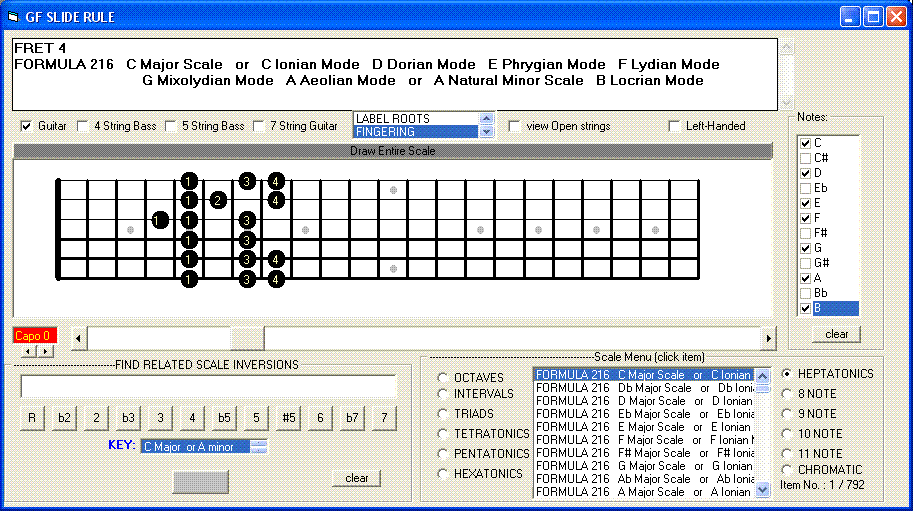



## GUITAR FRETBOARD SLIDE RULE

### Description

GF SLIDE RULE

This project illustrates scales and arpeggios for 6-string guitars, 4-string basses,

5-string basses and 7-string guitars. Exotic scales and all other 12-tone based scale formulas are included in the

scale appendix. The CAPO indicator and FINGERING GUIDE are the most recent additions to the program - which may be useful in learning obscured open positions.

Key Signatures can be viewed by selecting the HEPTATONIC option button from the

Scale Menu and clicking on FORMULA 216.

All scales are spelled out in all 12 keys and are generally listed to begin in the "Key of C

Major" (e.g. chords C - F - G7) OR in the "Key of A minor (e.g. Am -Dm - E7)". Try using the minor key if the Major key doesn't seem to blend with a particular scale. Else - try using chords

formed from the scale.

Only one function is shown for multi-function scales. Major arpeggios can be viewed by selecting the TRIADS option button and clicking on FORMULA 008.

Each position can be visualized separately by clicking the arrows of HScroll1 OR by using

the arrow keys [i.e. if the focus is set on HScroll1 (&lt; blinking)]...

A pick and a click track might come in handy...

To find names of related scale modes or scale inversions having the same "pitch chemistry":

1) enter any formula,

2) select and click the key signature

3) press the " = " button ...

...OR enter the mode spellings in the Notes menu.

Other related inversions will be shown in the textbox on top.

(Note: Some chords and scale formulas which still don't have a formal name are plainly

indicated as FORMULA ### ...)

The code is still more of a rough draft and the author &lt;; (me) might perform program

maintenance later if i think beautiful algorhythm . MIDI and "D tunings" are still

being analyzed... Until then... keep on coding, sing in tune and don't forget to remember...
 
### More Info
 

             |
---                |---
**Submitted On**   |2007-05-24 17:40:02
**By**             |[ha\_asgag](https://github.com/Planet-Source-Code/PSCIndex/blob/master/ByAuthor/ha-asgag.md)
**Level**          |Beginner
**User Rating**    |4.6 (23 globes from 5 users)
**Compatibility**  |VB 6\.0
**Category**       |[Miscellaneous](https://github.com/Planet-Source-Code/PSCIndex/blob/master/ByCategory/miscellaneous__1-1.md)
**World**          |[Visual Basic](https://github.com/Planet-Source-Code/PSCIndex/blob/master/ByWorld/visual-basic.md)
**Archive File**   |[GUITAR\_FRE2067345242007\.zip](https://github.com/Planet-Source-Code/ha-asgag-guitar-fretboard-slide-rule__1-68361/archive/master.zip)

